# Project: Binary Classification of Machine Failures

## Data Dictionary: Binary Classification of Machine Failures

This data dictionary describes the columns in the dataset used for binary classification of machine failures. The goal is to predict whether a machine will fail based on various operational parameters and failure flags.

| **Column Name**          | **Data Type** | **Description**                                                                                                | **Units**      | **Possible Values/Range**                                  | **Relevance to Machine Failure**                                                                    | **Potential Issues & Considerations**                                                                                                                      |
|--------------------------|---------------|--------------------------------------------------------------------------------------------------------------------|----------------|-----------------------------------------------------------|----------------------------------------------------------------------------------------------------|-----------------------------------------------------------------------------------------------------------------------------------------------------------------|
| **id**                   | `int64`       | Unique identifier for each data point (observation/row).                                                      | -              | Unique integer values.                                    | **Not directly predictive**, primarily for indexing and record identification.                    | Should be unique for all rows. Not to be used as a feature for model training directly unless indexing or time-series context is important (which is not indicated). |
| **Product ID**           | `object`      | Identifier for the product/machine being monitored. Could represent different machine types or serial numbers. | -              | Alphanumeric or string values (e.g., "L47181", "M29487", etc.). | May indicate **different machine models or batches** which could have varying failure characteristics. | Needs to be checked for cardinality. High cardinality might require dimensionality reduction or feature engineering techniques (like grouping or encoding).  Consider if it's ordinal or nominal.  Check for consistency in naming conventions. |
| **Type**                 | `object`      | Type of the machine or process.  Might represent different categories of machines or operational modes.       | -              | Categorical string values (e.g., "Type H", "Type M", "Type L").                                | Could indicate **inherent differences in reliability or operational stresses** based on machine type. | Check the distinct categories and their distribution. Consider encoding methods (One-Hot Encoding, Label Encoding) for machine learning models. Check for class imbalance across different types. |
| **Air temperature [K]**  | `float64`     | Air temperature surrounding the machine during operation.                                                     | Kelvin (K)     | Continuous positive values (typically in a realistic range for industrial environments, e.g., 290K - 310K). | **Environmental factor** that can influence machine component temperatures and performance. Higher temperatures can lead to increased stress and wear. | Check for realistic temperature ranges and potential outliers (sensor errors). Consider conversion to Celsius if more interpretable for some audiences.  May have seasonal or daily patterns. |
| **Process temperature [K]**| `float64`     | Process temperature of a specific part or component within the machine.                                        | Kelvin (K)     | Continuous positive values, typically higher than air temperature as it reflects internal machine operation. | **Direct indicator of machine operating condition.** Elevated process temperature can be a sign of overheating or inefficiency, potentially leading to failure. | Compare to air temperature; a significant difference might be important. Check for outliers and realistic operating ranges for the process. Potential correlation with 'Air temperature [K]'. |
| **Rotational speed [rpm]** | `int64`       | Rotational speed of a key machine component (e.g., spindle, motor shaft).                                  | Revolutions per minute (rpm) | Integer values, likely within a defined operational range for the machine type.                  | **Operational parameter directly related to machine stress and wear.**  Excessive or inconsistent speed can contribute to mechanical failures and fatigue. | Check for typical operating speed ranges and any unexpected values. Consider potential non-linear relationships with failure.  May be interactions with 'Torque [Nm]'. |
| **Torque [Nm]**          | `float64`     | Torque applied by the machine or on a specific component. Represents the rotational force.                      | Newton-meters (Nm) | Continuous positive values, typically within a machine's operational capacity.                      | **Indicates load and stress on the machine.** High torque can lead to strain and potential failure of mechanical parts. | Check for typical torque ranges and potential overload situations (unusually high values).  Consider relationships with 'Rotational speed [rpm]' and 'Tool wear [min]'. |
| **Tool wear [min]**        | `int64`       | Cumulative tool wear measured in minutes.  Represents the amount of wear and tear on a cutting or working tool. | Minutes (min)  | Non-negative integer values, increasing over time or usage.                                  | **Direct measure of tool degradation.**  Excessive tool wear can lead to decreased performance, quality issues, and eventually machine failure if not addressed. | Tool wear should generally be monotonically increasing. Look for resets or anomalies. Consider the relationship between tool wear and maintenance schedules. |
| **Machine failure**      | `int64`       | **Target variable**. Binary indicator of machine failure.                                                              | -              | Binary values: `0` (No failure), `1` (Failure).                                       | **The variable to be predicted.** Indicates whether a machine has experienced a failure event during the observation period. | Understand the definition of "failure" in this context (e.g., critical breakdown, performance degradation beyond a threshold). Check for class imbalance (ratio of failures to non-failures). |
| **TWF**                  | `int64`       | Tool Wear Failure flag. Indicates if a failure occurred specifically due to tool wear.                               | -              | Binary values: `0` (No TWF), `1` (TWF).                                              | **Specific type of failure indicator.** May provide insights into root causes of machine failures.  Could be correlated with 'Tool wear [min]' and 'Machine failure'. |  Check correlation with 'Tool wear [min]' and 'Machine failure'. Understand if TWF is a *cause* of 'Machine failure' or a *subtype*. |
| **HDF**                  | `int64`       | Heat Dissipation Failure flag. Indicates if a failure occurred due to issues related to heat dissipation (e.g., overheating). | -              | Binary values: `0` (No HDF), `1` (HDF).                                              | **Specific type of failure indicator.**  Related to temperature parameters.  Could be correlated with 'Air temperature [K]' and 'Process temperature [K]'. | Check correlation with temperature columns and 'Machine failure'. Similar to TWF, understand its causal relationship. |
| **PWF**                  | `int64`       | Power Failure flag. Indicates if a failure occurred due to power related issues (e.g., power surge, power loss).        | -              | Binary values: `0` (No PWF), `1` (PWF).                                              | **Specific type of failure indicator.**  May point to electrical system problems.                                 | Consider if there are other power-related features not explicitly listed. Understand its correlation with 'Machine failure'. |
| **OSF**                  | `int64`       | Overstrain Failure flag. Indicates if a failure occurred due to excessive strain or stress on machine components. | -              | Binary values: `0` (No OSF), `1` (OSF).                                              | **Specific type of failure indicator**, Related to mechanical stress and load. May be linked to 'Torque [Nm]' and 'Rotational speed [rpm]'. | Check correlation with 'Torque [Nm]', 'Rotational speed [rpm]', and 'Machine failure'.  Understand the definition of "overstrain" in this context. |
| **RNF**                  | `int64`       | Random Failure flag. Indicates if a failure occurred due to random or unexplained reasons, or if it couldn't be attributed to TWF, HDF, PWF, or OSF. | -              | Binary values: `0` (No RNF), `1` (RNF).                                              | **Specific type of failure indicator**, capturing failures not explained by other specific failure types. May represent unexpected or complex failure modes. |  Understand the criteria for classifying a failure as "Random".  Check if RNF is mutually exclusive with other failure flags or if it can co-occur. |

**Key Considerations for Data Analysis and Machine Learning:**

* **Feature Scaling:** Numerical features like temperature, rotational speed, torque, and tool wear are on different scales. Feature scaling (e.g., Standardization or Min-Max Scaling) will be important for many machine learning algorithms.
* **Categorical Feature Encoding:**  'Product ID' and 'Type' are categorical features and need to be encoded into numerical representations for most machine learning models (e.g., One-Hot Encoding, Label Encoding, or potentially more advanced embeddings depending on cardinality and information content).
* **Correlation and Multicollinearity:** Check for correlations between features, especially between 'Air temperature [K]' and 'Process temperature [K]', and between 'Rotational speed [rpm]' and 'Torque [Nm]'. High multicollinearity might affect model stability and interpretability.
* **Class Imbalance:**  Machine failure datasets often exhibit class imbalance (fewer failures than non-failures). Techniques to handle class imbalance (e.g., oversampling, undersampling, SMOTE, class weights in models) might be necessary.
* **Feature Interactions:** Consider exploring interactions between features. For example, the combination of high 'Process temperature [K]' and high 'Torque [Nm]' might be a stronger predictor of failure than either feature alone.
* **Time Dependency (If Applicable):** While not explicitly stated, if the data is collected over time, consider if there is any temporal dependency or trends that might be important (though 'id' being just an integer might suggest rows are independent snapshots).
* **Failure Type Flags:** The flags TWF, HDF, PWF, OSF, and RNF provide valuable insights into failure modes. Analyze their distributions, correlations with other features, and their relationship to the target variable 'Machine failure'.  Determine if they are mutually exclusive or can co-occur.
* **Domain Knowledge:** Leveraging domain knowledge about machine operation and failure modes will be crucial for feature engineering, model selection, and interpreting results.

This data dictionary provides a solid foundation for understanding and working with the dataset "Binary Classification of Machine Failures" dataset.

## Data Analysis Results

## Descriptive Statistics

The following table shows descriptive statistics of the features presented in the dataset.

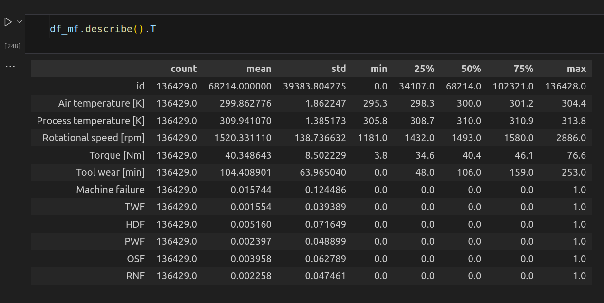

## Class imbalance

The next figure shows the proportion of each class, 0 being the *normal functioning state* and 1  the *failure state*, for all the instances dataset, evidencing a highly imbalanced dataset, where the majority class is more than 60 times prevalent than the minority one.

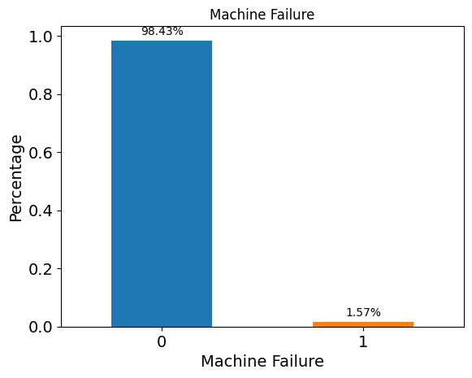

## Class imbalance as a function of operational mode

The following figure depicts the class imbalance, displaying the number of instances, for each kind of operational mode. The "L" mode dispalys the largest number of instances of failures and non-failures modes.

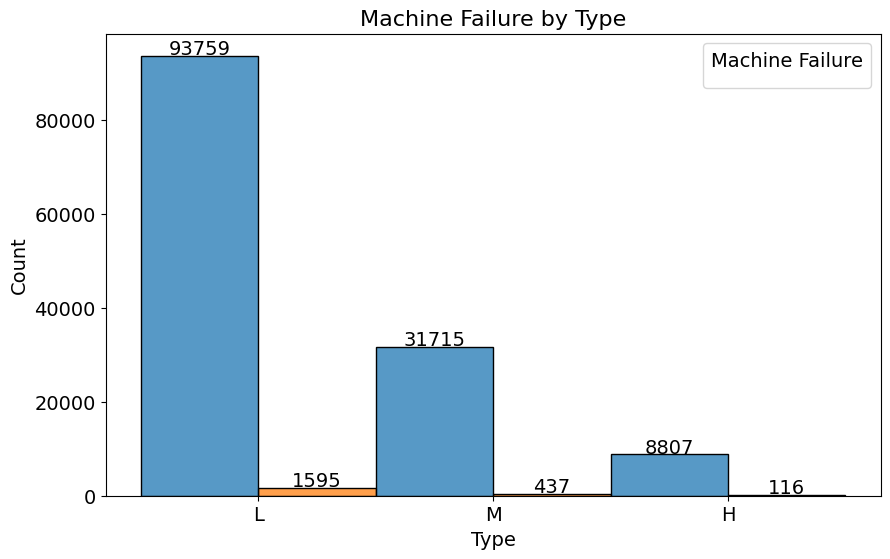

## Machine failure proportion by each kind of operational mode

The following figure shows the machine failure proportion according to each kind of operational mode. In spite of the high number of imbalance concerning the number of instances for each operational mode, the proportion of failures in each operational mode is relatively balanced.

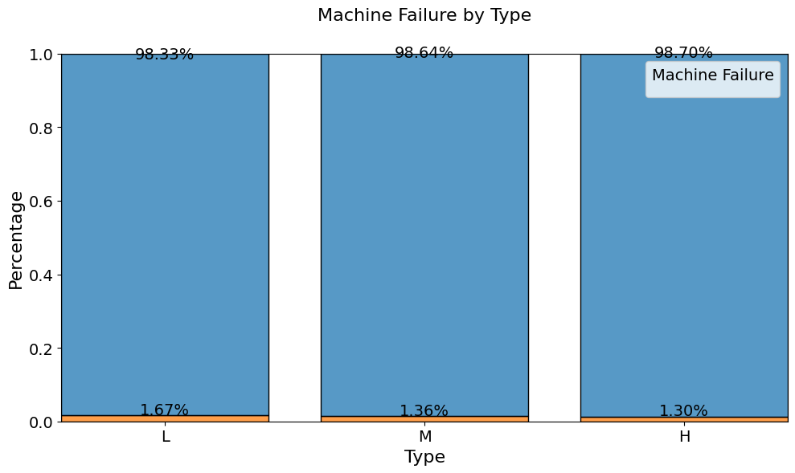

## Boxplot of features according to Machine Failure

The following figure shows a boxplot of selected features according to Machine Failure, from which one can observe that failures-events tend to have a larger number for **Air Temperature, Process Temperature, and Torque**.

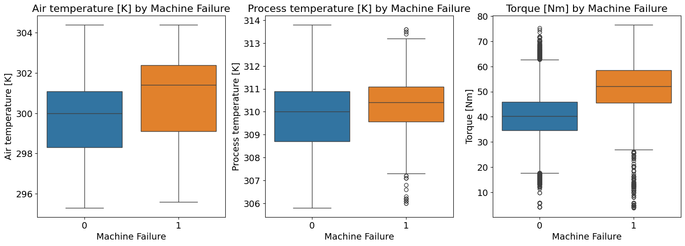

## Violinplot of features according to Machine Failure

The following figure shows a violinplot of selected features according to Machine Failure, evidencing what was stated in the previous figure.

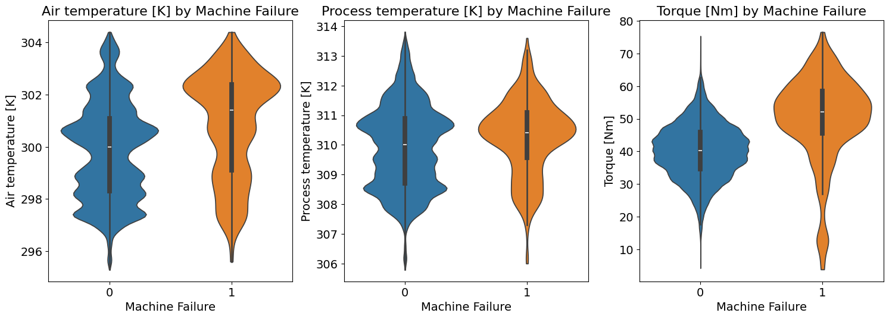

## Boxplot of features according to the kind of...

The next figure shows a boxplot of three selected features according to the kind of operational mode. Curiously, there is a balance in the range of values for **Air Temperature, Process Temperature, and Torque** as a function of the operational mode.

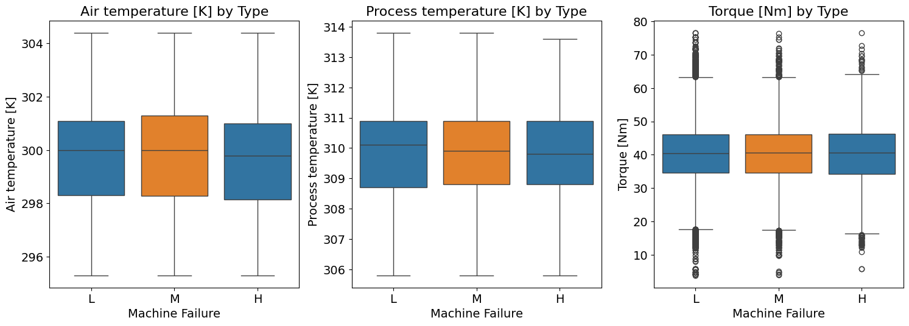

## Violinplot of features according to kind of...

The following figure shows a violinplot of features according to kind of operational mode, evidencing what was stated about the previous figure.

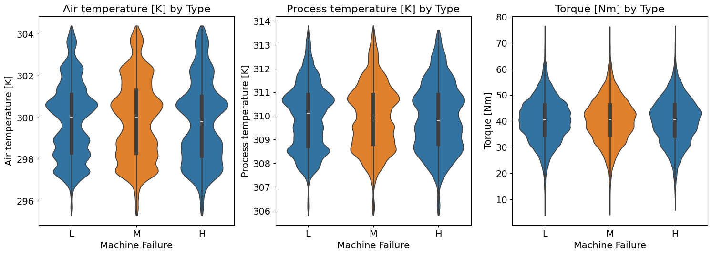

## Violin plot for numeric features according to Machine Failure

The next figure shows a violin plot for numeric features according to Machine Failure attribute, from which one can clearly notice that for **Tool wear, TWF, HDF, PWF, OSF, and RNF** there is a clear distinct behavior concerning failures and non-failure events. 

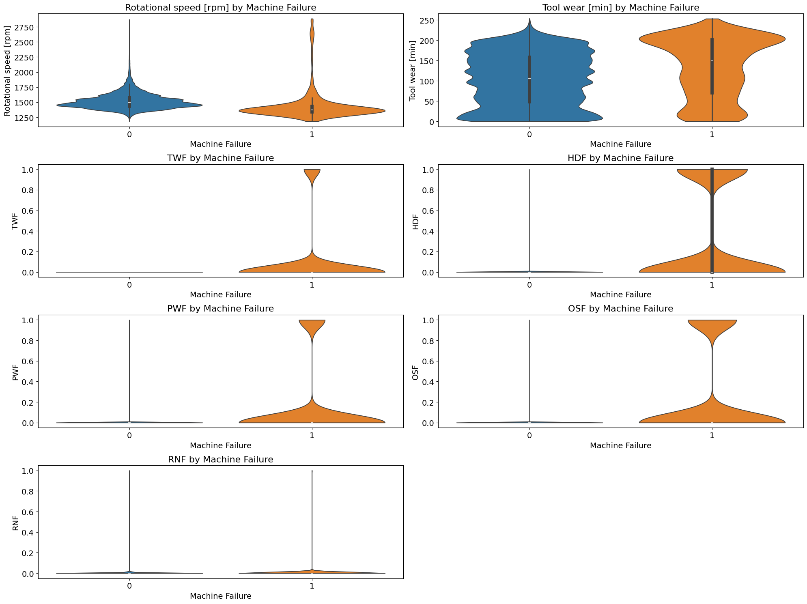

## Violin plot for numeric features according to kind of

The following figure shows a violin plot for numeric features according to kind of operational, and there seems to be a similar behavior accross each kind of operational mode, curiously.

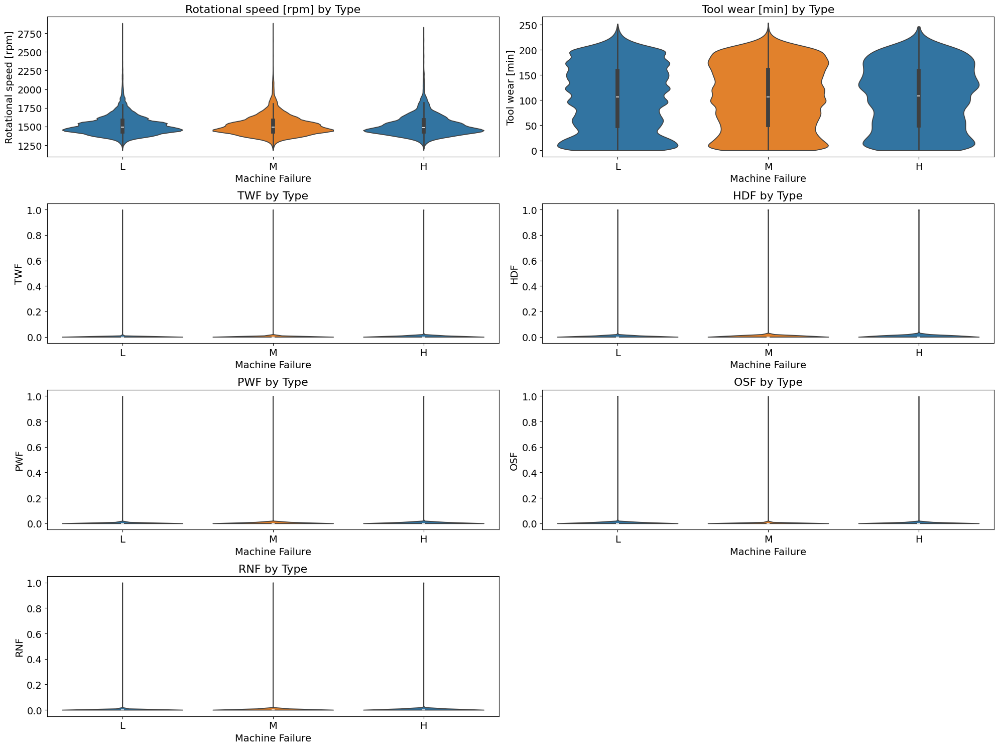

## Correlation Matrix

The next figure shows the correlation matrix comprising all the features present in the dataset, except the target variable (failure or not), ID, product ID, and type... The highly correlated features were dropped from this dataset.

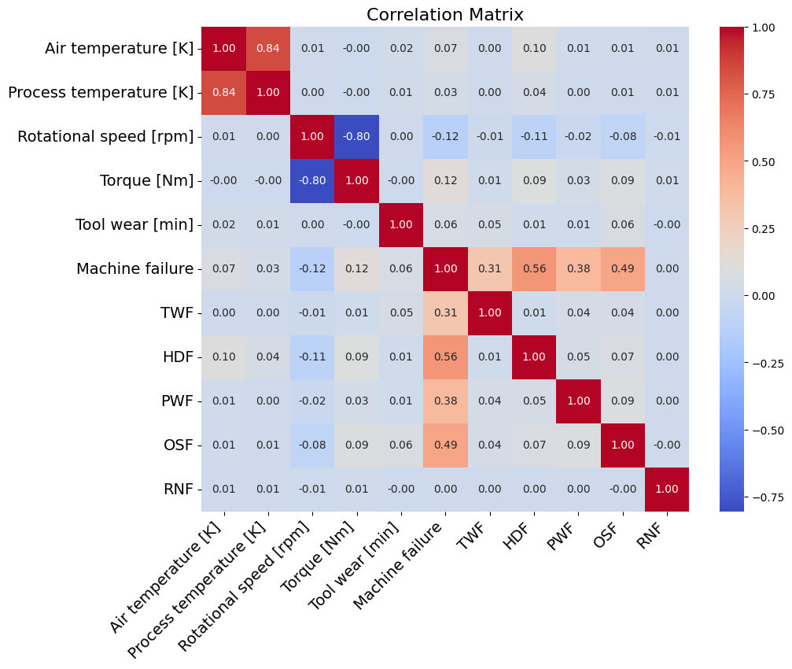

## Top 20 Product's ID with the largest number of instances of failures 

The next figure shows the top 20 Product's ID with the largest number of instances of failures.

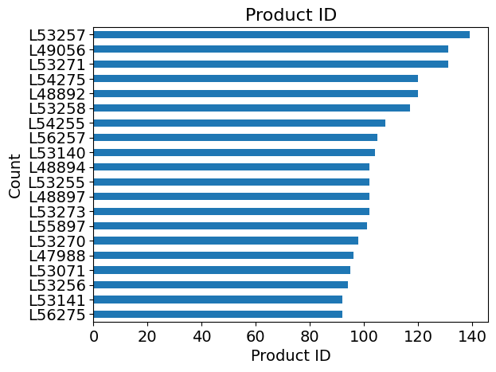

## Product's IDs with the Highest Average Failure Rate

The next figure shows the top 20 Product's ID with the highest average failure rates. There are only two product's IDS with 100% average failure rate, and only two with 75% average failure rate.

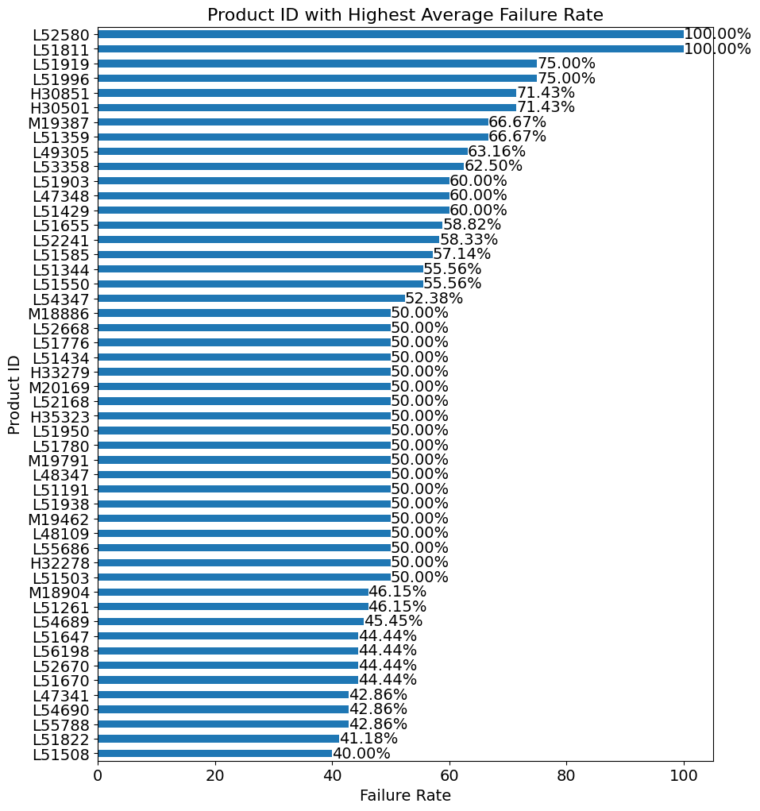

## Product's IDs with the least number of failures

The next figure shows the Product's IDs with the least number of failures, but different than zero.

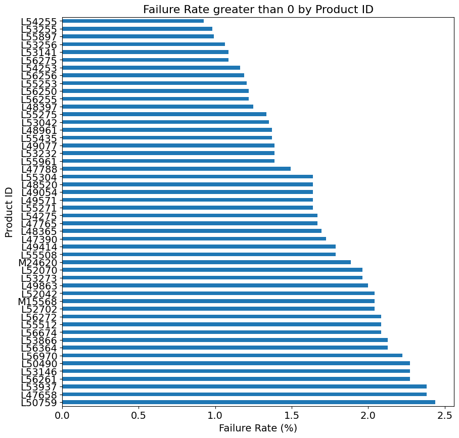

## Product's IDs with the Highest Count of Failure's

The following figure shows the Product's IDs with the Highest Count of Failure's, showing that 14 Product's IDs have a total number of failure counts totaling more than 100.

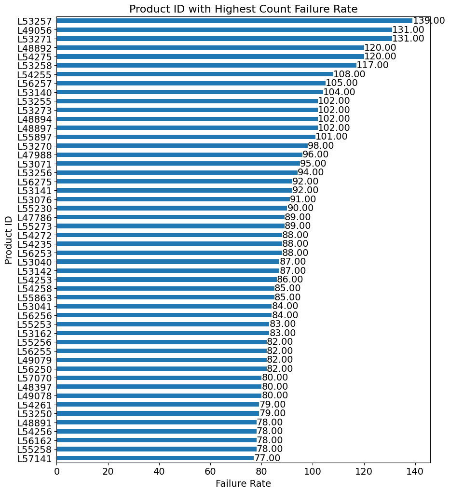

## Machine Learning Modeling Results

The next figure shows the results on the testing set by using a **XGBoost Classifier**, using stratification of the classes and a shuffle split(**StratifiedShuffleSplit**) by considering the number of splits equal to 2. The f1-score of the majority class is perfect (1.0), and for the minority class there is a downgrade in the performance regarding the recall metrics (around 0.78), showing that in some situations there could be a failure instance being classified as a normal instance (False Negative). However, **the AUC metrics lays around 90%, which evidences a good overall performance for this classification problem**.

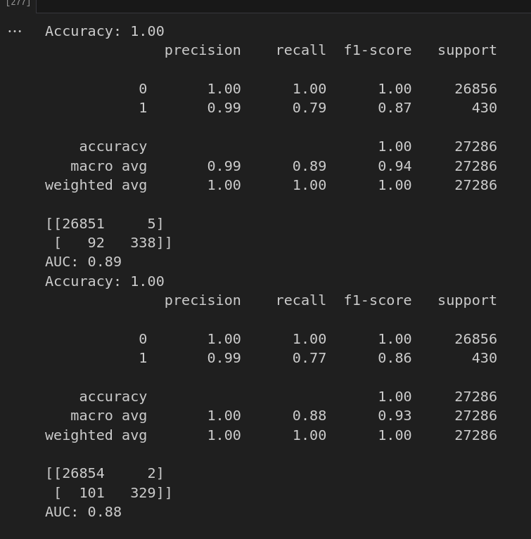

## Summary of the Key Findings

1. Data Characteristics and Preprocessing:

- Feature Scaling Required: Numerical features have different scales, necessitating scaling.
- Multicollinearity Present: High correlation exists between 'Air temperature' and 'Process temperature', and 'Rotational speed' and 'Torque'.
- Significant Class Imbalance: The dataset is heavily imbalanced, with normal functioning states vastly outnumbering failure states (more than 60 times).
- Failure Type Flags: Flags like TWF, HDF, PWF, OSF, and RNF provide detailed failure mode information.

2. **Data Analysis Results**:

- Descriptive Statistics: 
The provided table shows the basic statistical summary of all the numerical features.
- Class Imbalance:
The dataset is extremely imbalanced, with a large majority of normal operation instances.
Operational mode 'L' has the highest number of instances of both failures and non-failures.
The proportion of failures across different operational modes is relatively balanced.
- Feature Distributions and Failure:
Failure events tend to occur with higher 'Air Temperature', 'Process Temperature', and 'Torque' values.
Tool wear, TWF, HDF, PWF, OSF, and RNF all show distinct behavior between failure and non failure events.
Operational modes do not significantly affect the range of the numerical features.
- Correlation:
A correlation matrix reveals relationships between features, with highly correlated features being dropped.
- Product ID Analysis:
The top 20 Product IDs with the highest number of failure instances are identified.
Some Product IDs have 100% or 75% average failure rates.
Product IDs with the least number of failures, that are greater than zero, were identified.
The products IDs with the highest count of failures show that 14 of the products had more than 100 failures.
Machine Learning Results:

3. **Model: XGBoost Classifier.**
Evaluation: StratifiedShuffleSplit (2 splits).
- Performance:
Perfect f1-score for the majority class (1.0).
Recall for the minority class is around 0.78 (some false negatives).
AUC is approximately 90%, indicating good overall performance.

## Real-World Usage Scenarios

1. **Predictive Maintenance and Reduced Downtime**:

**Real-world scenario**: A large manufacturing plant relies on complex machinery. Unplanned downtime due to failures can halt production, leading to substantial financial losses.
Usage:
The XGBoost model, with its 90% AUC, can be deployed to predict impending machine failures.
Alerts are generated when the model detects a high probability of failure, allowing maintenance teams to schedule proactive repairs.
This minimizes unexpected downtime, optimizes maintenance schedules, and increases production efficiency.
**By identifying which product IDs have the highest failure rates, maintenance can be focused on those parts.**
**Economic Impact**: Significant cost savings due to reduced downtime, improved equipment lifespan, and optimized resource allocation.

2. **Quality Control and Defect Prevention**:

**Real-world scenario**: A high-precision component manufacturer needs to ensure consistent product quality. Machine failures can lead to defects and scrap.
Usage:
The model can identify operational parameters (temperature, torque, tool wear) that correlate with failures.
Real-time monitoring of these parameters allows for adjustments to prevent defects before they occur.
Analysis of the failure type flags (TWF, HDF, PWF, OSF, RNF) can pinpoint specific failure modes, enabling targeted quality control measures.
**Economic Impact**: Reduced scrap rates, improved product consistency, and enhanced customer satisfaction.

3. **Process Optimization**:

**Real-world scenario**: An industrial facility wants to optimize its production processes to minimize energy consumption and maximize output.
Usage:
Analyzing the correlation between operational parameters and failure rates can identify inefficient operating conditions.
For example, understanding how temperature and torque affect failure can lead to adjustments that reduce stress on machinery.
The operational mode analysis can help determine which modes are most efficient and reliable.
The data analysis that shows the product IDs with the least amount of failures, can show which products are more reliable, and therefore which ones to create more of.
**Economic Impact**: Reduced energy consumption, increased throughput, and optimized resource utilization.

4. **Failure Mode Analysis and Design Improvements**:

**Real-world scenario**: An engineering company designs and manufactures industrial equipment. They want to improve the reliability of their products.
Usage:
Analyzing the failure type flags and correlating them with operational parameters can provide insights into the root causes of failures.
This information can be used to redesign components or modify operating procedures to prevent recurring failures.
The product ID failure rate analysis can identify specific components or designs that are prone to failure.
**Economic Impact**: Improved product reliability, reduced warranty claims, and enhanced brand reputation.

5. **Supply Chain Management**:

Real-world scenario: A company that relies on just in time manufacturing, needs to know when parts are going to fail to properly order new parts.
Usage:
By predicting machine failure, and therefore part failure, the company can properly predict when new parts need to be ordered.
This will reduce the amount of time that a machine is down, waiting for parts to arrive.
**Economic Impact**: Reduced down time, and reduced storage costs.

6. **Safety and Risk Management**:

**Real-world scenario**: Industries with potentially hazardous machinery (e.g., chemical plants, power generation) require strict safety protocols.
Usage:
Predictive maintenance can prevent catastrophic failures that could lead to accidents or environmental damage.
Real-time monitoring and alerts can provide early warnings of potential hazards.
**Economic Impact**: Reduced risk of accidents, minimized environmental impact, and improved regulatory compliance.

**Key Implementation Considerations**:

1. **Real-time data integration**: The model needs to be integrated with real-time sensor data from the machinery.
2. **Cloud-based solutions**: Cloud based solutions can be used to store and process the large amounts of data that are produced by modern industrial equipment.
3. **User interface development**: A user-friendly interface is needed to display predictions and alerts to maintenance personnel.
4. **Continuous model improvement**: The model should be continuously updated with new data to maintain its accuracy.

## Acknowledgements

## MIT License

Copyright (c) [2025] [Dr. Vagner Zeizer Carvalho Paes]

Permission is hereby granted, free of charge, to any person obtaining a copy
of this software and associated documentation files (the "Software"), to deal
in the Software without restriction, including without limitation the rights
to use, copy, modify, merge, publish, distribute, sublicense, and/or sell
copies of the Software, and to permit persons to whom the Software is
furnished to do so, subject to the following conditions:

The above copyright notice and this permission notice shall be included in all
copies or substantial portions of the Software.

THE SOFTWARE IS PROVIDED "AS IS", WITHOUT WARRANTY OF ANY KIND, EXPRESS OR
IMPLIED, INCLUDING BUT NOT LIMITED TO THE WARRANTIES OF MERCHANTABILITY,
FITNESS FOR A PARTICULAR PURPOSE AND NONINFRINGEMENT. IN NO EVENT SHALL THE
AUTHORS OR COPYRIGHT HOLDERS BE LIABLE FOR ANY CLAIM, DAMAGES OR OTHER
LIABILITY, WHETHER IN AN ACTION OF CONTRACT, TORT OR OTHERWISE, ARISING FROM,
OUT OF OR IN CONNECTION WITH THE SOFTWARE OR THE USE OR OTHER DEALINGS IN THE
SOFTWARE.
